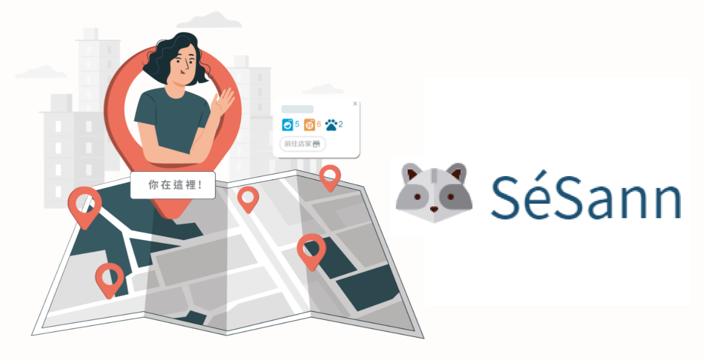
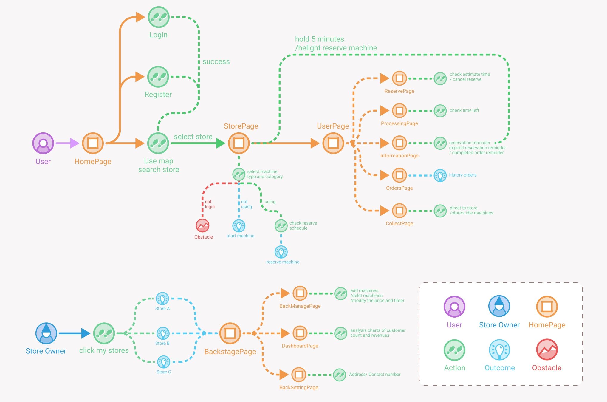
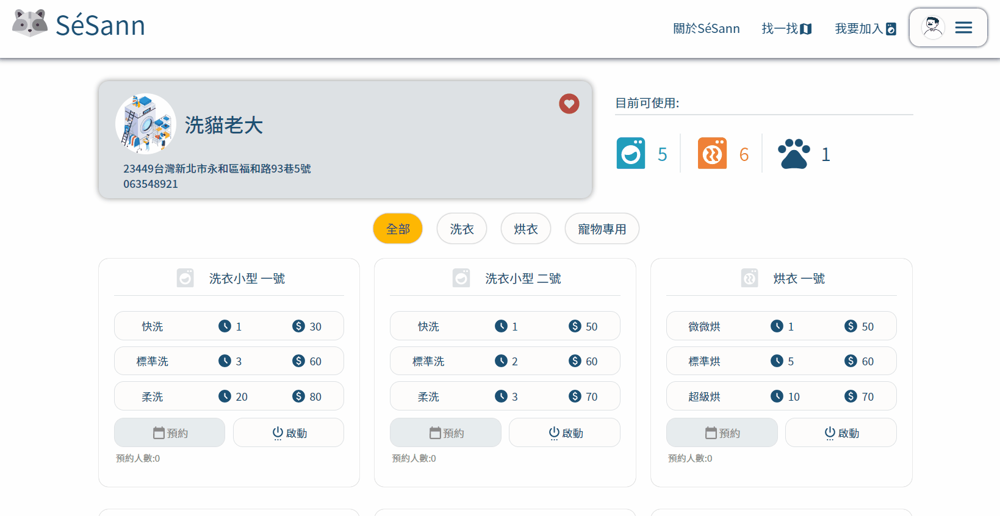
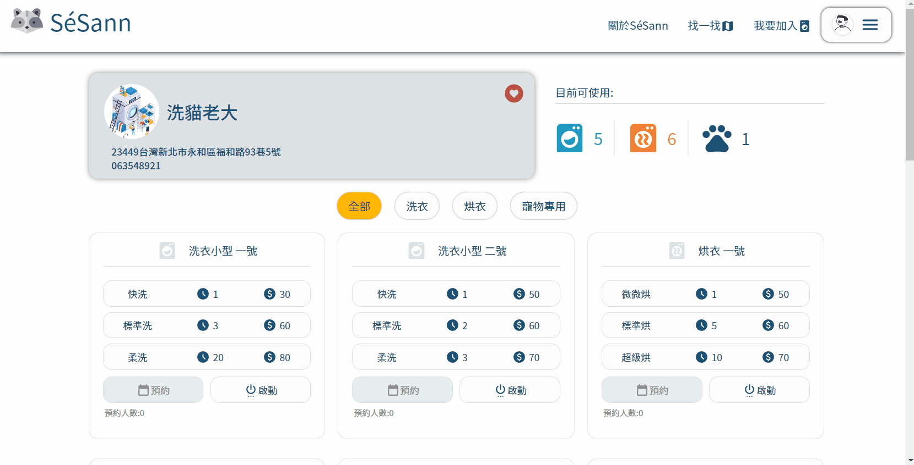
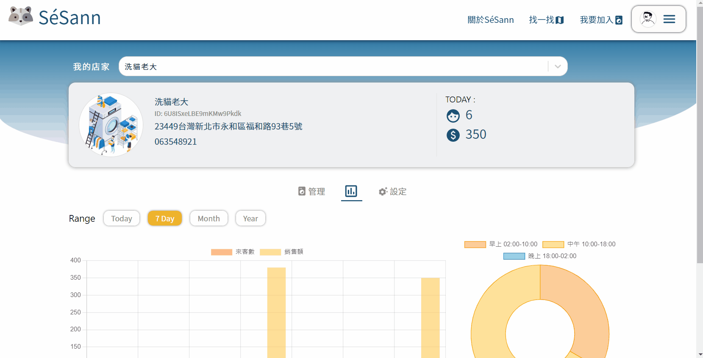

# SéSann
Do you always have to arrive at the laundromat to find out if there are any free machines?
When it arrives at the laundromat, it is all in use. Is it a waste of time to wait for a long time?
This platform is to solve the problem that the current laundromats make users have poor experience.
> [Demo](https://laundry-27ace.web.app/)

- Provided daily, weekly and monthly **analysis charts** of customer count and revenues in the store backstage.
- Combined Leaflet map to display **real-time machine status** of every store in each district. 
- Allowed store owners to efficiently manage multiple branches and facilities through **backstage page**.
- Implemented **real-time notifications** to inform consumers reservation and operation statuses
- Displayed number of consumers ahead and estimated waiting time in **appointment schedule** for users to evaluate

  
Table of Contents

  <ol>
    <li>
      <a href="#technologies-used">Technologies Used</a>
    </li>
    <li><a href="#user-flow">User Flow</a></li>
    <li><a href="#future-demo">Future Demo</a></li>
    <li><a href="#contact">Contact</a></li>
  </ol>

 

## Technologies Used
* Front-End
  * HTML
  * CSS
  * JavaScript
  * Firebase (Firestore / Storage / Auth)
* Frameworks & Frameworks related
  * React.js (Hooks)
  * React Router
  * prop-types
* Packages
  * leaflet
  * react-chartjs-2
  * dayjs
  * axios
  * react-spring
  * styled-components
  * styled-icons
* Others
  * API: Google Geocoding API
  * tools: Figma / ESLint / Prettier
## User Flow

## Future Demo
### HomePage

### StorePage

### UserPage

### BackstagePage

##  Contact

Welcome for any suggestion or collaboration, feel free to contact me! 

Created by **Zoe** [@ZoeHaveFun](https://github.com/ZoeHaveFun)  
[zoehavefun06@gmail.com](mailto:zoehavefun06@gmail.com) | [Linkedin](https://www.linkedin.com/in/fan-zoe-b10480246/)

<a href="#top">back to top</a>
